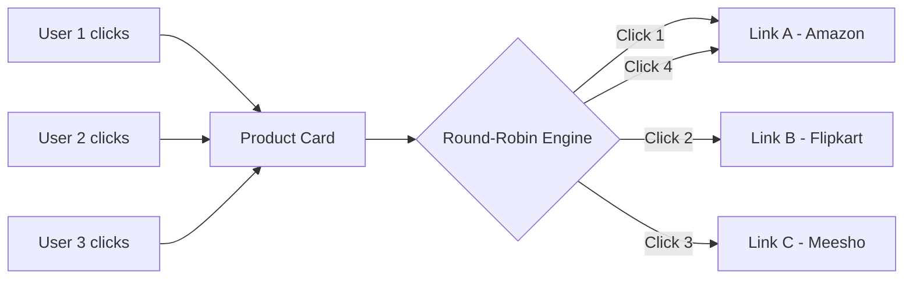
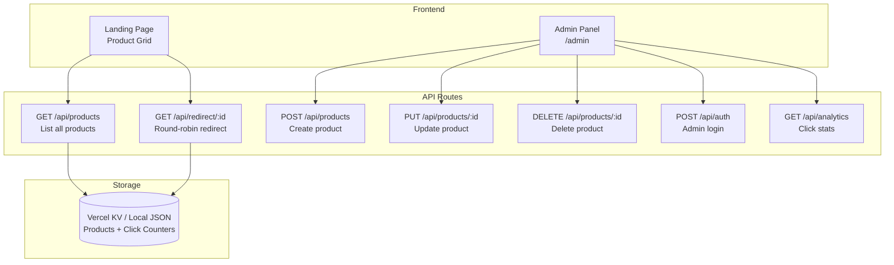

# E-Commerce Landing Page with Smart Link Rotation

Build a premium e-commerce landing page where each product has multiple backend affiliate/redirect links. When users click a product's "Buy Now" button, they are distributed across those links in a **round-robin** fashion (User 1 → Link A, User 2 → Link B, User 3 → Link C, User 4 → Link A again...). Includes a full **Admin Panel** for managing products and their link pools.

## Core Concept



## User Review Required

> [!IMPORTANT]
> **Technology Choice**: I plan to use **Next.js** (like your previous redirect-concept project) deployed on **Vercel** with **Vercel KV (Redis)** for global state persistence. This ensures the round-robin counter is shared across ALL visitors globally (not per-browser). Is this acceptable, or do you want a simpler static HTML/JS approach with localStorage?

> [!IMPORTANT]
> **Admin Panel Security**: The admin panel will use a simple password-based auth (environment variable `ADMIN_PASSWORD`). For production, you'd want proper authentication. Is a simple password sufficient for now?

> [!WARNING]
> **Product Images**: I'll use AI-generated product images for the demo. You can replace them with real product images later. Should I generate specific product categories (electronics, fashion, etc.)?

## Open Questions

1. **Product Categories**: Do you want product categories/filters on the landing page, or just a flat grid of all products?
2. **Analytics**: Do you want to see click analytics per product (total clicks, clicks per link) in the admin panel?
3. **Link Weights**: Should all links get equal distribution (strict round-robin), or do you want weighted distribution (e.g., Link A gets 50% traffic, Link B gets 30%, Link C gets 20%)?
4. **Number of Demo Products**: How many initial demo products should I seed? I'm thinking 8-12 products across categories.

---

## Proposed Changes

### Architecture Overview



---

### 1. Project Setup

#### [NEW] Next.js App Initialization
- Initialize Next.js with TypeScript, Tailwind CSS, App Router
- Install dependencies: `@vercel/kv`, `lucide-react`, `uuid`
- Configure for Vercel deployment

---

### 2. Data Layer

#### [NEW] `src/lib/store.ts` — Product & State Management
- **Product data model**:
  ```typescript
  interface Product {
    id: string;
    name: string;
    description: string;
    price: string;
    image: string;
    category: string;
    links: { url: string; label: string }[];
    nextLinkIndex: number;  // round-robin counter
    totalClicks: number;
    clicksPerLink: number[];
    createdAt: string;
  }
  ```
- **Functions**: `getProducts()`, `addProduct()`, `updateProduct()`, `deleteProduct()`, `getNextLink(productId)` (atomic round-robin)
- **Dual mode**: Vercel KV in production, local JSON file in development

#### [NEW] `src/lib/auth.ts` — Simple Admin Auth
- Password check against `ADMIN_PASSWORD` env variable
- JWT-like token generation using a simple hash for session persistence

---

### 3. API Routes

#### [NEW] `src/app/api/products/route.ts`
- `GET`: Return all products (without sensitive link data for public)
- `POST`: Create new product (admin only, requires auth token)

#### [NEW] `src/app/api/products/[id]/route.ts`
- `PUT`: Update product details and links (admin only)
- `DELETE`: Remove product (admin only)

#### [NEW] `src/app/api/redirect/[id]/route.ts`
- `GET`: The **core engine** — atomically reads the product's `nextLinkIndex`, gets the corresponding URL, increments the index (wrapping around), and returns a 307 redirect
- Opens the destination URL directly — zero latency for the user

#### [NEW] `src/app/api/auth/route.ts`
- `POST`: Validate admin password, return session token

#### [NEW] `src/app/api/analytics/route.ts`
- `GET`: Return click statistics per product and per link (admin only)

---

### 4. Landing Page (Public)

#### [NEW] `src/app/page.tsx` — E-Commerce Landing Page
- **Hero Section**: Premium gradient hero with tagline and CTA
- **Product Grid**: Responsive grid (4 cols desktop, 2 cols tablet, 1 col mobile)
- **Product Cards**: Each card shows:
  - Product image (AI-generated)
  - Product name, description, price
  - "Buy Now" button → calls `/api/redirect/[id]` (opens in `_blank`)
  - Subtle hover animations, glassmorphism effects
- **Category Filter**: Optional filter bar at the top
- **Footer**: Minimal branding

#### [NEW] `src/app/globals.css` — Design System
- Premium color palette (modern e-commerce aesthetic)
- Custom animations (fade-in, slide-up, pulse)
- Glassmorphism card styles
- Responsive typography using Google Fonts (Inter/Outfit)

#### [NEW] `src/app/layout.tsx` — Root Layout
- SEO meta tags, Google Fonts, favicon
- Clean HTML structure

---

### 5. Admin Panel

#### [NEW] `src/app/admin/page.tsx` — Admin Dashboard
- **Login Gate**: Password input → validates against API → stores token in sessionStorage
- **Product Management Table**: 
  - List all products with name, price, category, total clicks
  - Edit / Delete buttons per row
- **Add Product Form**:
  - Product name, description, price, category, image URL
  - **Dynamic link list**: Add/remove multiple links with labels (e.g., "Amazon", "Flipkart")
  - Preview card showing how the product will look
- **Analytics View**:
  - Per-product click breakdown
  - Per-link click distribution (bar chart or table)
  - Total traffic overview
- **Bulk Actions**: Reset click counters, export data

---

### 6. UI Components

#### [NEW] `src/components/ProductCard.tsx`
- Reusable product card with image, details, and CTA button
- Hover effects: scale, shadow elevation, button color shift
- Loading skeleton state

#### [NEW] `src/components/AdminProductForm.tsx`
- Form for adding/editing products
- Dynamic link input rows (add/remove)
- Form validation

#### [NEW] `src/components/Navbar.tsx`
- Sticky navigation bar
- Logo, category links, admin access icon

---

### 7. Product Images

I will generate **8 premium product images** using the image generation tool:
1. Wireless Headphones
2. Smart Watch
3. Running Shoes
4. Laptop
5. Backpack
6. Sunglasses
7. Coffee Maker
8. Phone Case

---

## Verification Plan

### Automated Tests
1. **Build Check**: `npm run build` — ensure zero errors
2. **Local Dev Test**: `npm run dev` — verify landing page renders correctly
3. **API Tests**: 
   - Hit `/api/products` to confirm product listing
   - Hit `/api/redirect/[id]` multiple times to verify round-robin rotation
4. **Browser Test**: Use browser subagent to:
   - Navigate the landing page
   - Click product "Buy Now" buttons and verify redirect rotation
   - Log into admin panel and add/edit a product

### Manual Verification
- Visual inspection of the landing page design via browser screenshots
- Verify admin panel CRUD operations work end-to-end
- Confirm round-robin distribution is correct across multiple clicks
